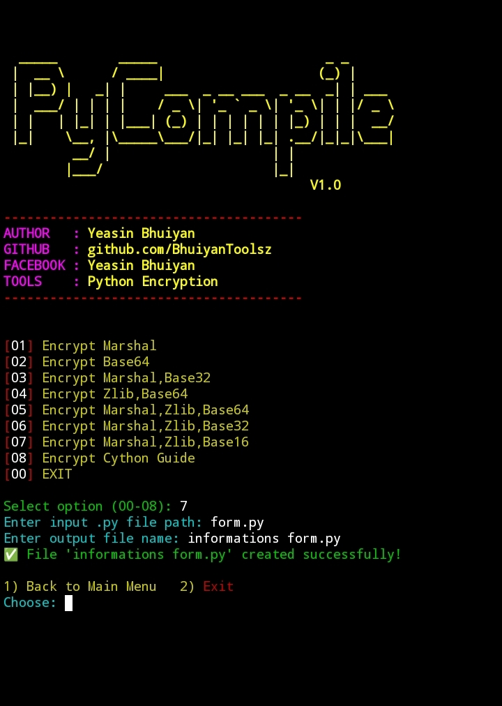
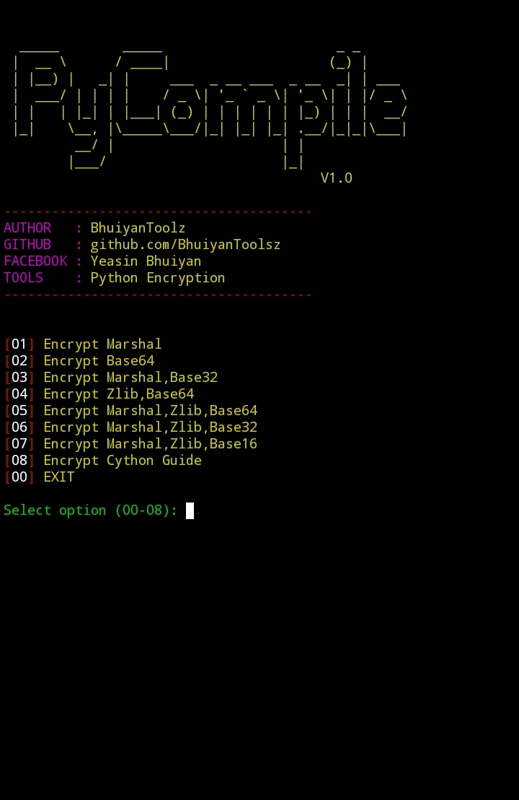

<h1 align="center">Py Compile & Encryption</h1>

  
  
  
  

<h2>Login Information</h2>

⚠️ Do NOT share your credentials publicly.

<ul>
  <li>Username: <strong>BTZ</strong></li>
  <li>Password: <strong>BHUIYAN TOOLSZ</strong></li>
</ul>

Example for local use:

<pre><code>USERNAME = "BTZ"
PASSWORD = "BHUIYAN TOOLSZ"</code></pre>

<h2>Features</h2>
<ul>
  <li>✅ User Login System (Username & Password protected)</li>
  <li>✅ Banner Display with Author, GitHub, Facebook, and Tool info</li>
  <li>✅ Multiple Encryption Methods:
    <ul>
      <li>Marshal Encryption</li>
      <li>Base64 Encryption</li>
      <li>Marshal + Base32</li>
      <li>Zlib + Base64</li>
      <li>Marshal + Zlib + Base64</li>
      <li>Marshal + Zlib + Base32</li>
      <li>Marshal + Zlib + Base16</li>
    </ul>
  </li>
  <li>✅ Cython Quick Guide (Option 08)</li>
  <li>✅ Input .py File & Output Encrypted .py File</li>
  <li>✅ Friendly Error Handling for Missing Files</li>
  <li>✅ Back to Menu or Exit Option after each operation</li>
  <li>✅ Colored Terminal Output for better UI</li>
  <li>✅ Smooth typing effect using slow() function</li>
</ul>

<h2>📥 Installation</h2>

<strong>Just copy and paste the commands below 👇</strong>

<pre style="background:#f4f4f4; padding:10px; border:1px solid #ccc;"><code>
pkg update && pkg upgrade
pkg install python
pkg install git
pkg install python git -y
git clone https://github.com/BhuiyanToolsZ/PyCompile-Encryption-.git
cd PyCompile-Encryption-
python py_compile.py
</code></pre>

<h2>Usage</h2>
<ol>
  <li>Run the tool using Python:
    <pre><code>python3 PyCompileEncryption.py</code></pre>
  </li>
  <li>Enter your username and password to login:
    <ul>
      <li>Username: <strong>BTZ</strong></li>
      <li>Password: <strong>BHUIYAN TOOLSZ</strong></li>
    </ul>
  </li>
  <li>Select an encryption method from the menu:
    <ul>
      <li>01 → Encrypt using Marshal</li>
      <li>02 → Encrypt using Base64</li>
      <li>03 → Encrypt using Marshal + Base32</li>
      <li>04 → Encrypt using Zlib + Base64</li>
      <li>05 → Encrypt using Marshal + Zlib + Base64</li>
      <li>06 → Encrypt using Marshal + Zlib + Base32</li>
      <li>07 → Encrypt using Marshal + Zlib + Base16</li>
      <li>08 → View Cython Quick Guide</li>
      <li>00 → Exit the tool</li>
    </ul>
  </li>
  <li>Enter input Python (.py) file path.</li>
  <li>Enter output file name (or press Enter to use default <strong>output.py</strong>).</li>
  <li>The tool will create the encrypted file in the same directory.</li>
  <li>After encryption, choose:
    <ul>
      <li>1 → Back to main menu</li>
      <li>2 → Exit the tool</li>
    </ul>
  </li>
  <li>All operations display colored terminal output and smooth typing effects for better user experience.</li>
  <li>Friendly error handling for missing input files or invalid choices.</li>
</ol>

<h2 style="color:darkred;">Important Notes</h2>
<ul>
  <li>⚠️ Ensure you are using Python to run this tool.</li>
  <li>⚠️ The tool requires the input file to be a valid <strong>.py</strong> Python script.</li>
  <li>⚠️ The output file will overwrite if a file with the same name exists in the directory.</li>
  <li>⚠️ Keep the <strong>.so</strong> files in the same folder if you want to import compiled modules.</li>
  <li>⚠️ This tool does not use any external Python libraries, so no additional installation is needed.</li>
  <li>⚠️ For security, keep your username and password confidential.</li>
  <li>⚠️ Encrypted files are Python-executable, but may be flagged by some antivirus software.</li>
  <li>⚠️ Always back up your original scripts before encryption.</li>
  <li>⚠️ Use responsibly; do not encrypt or distribute scripts without permission.</li>
</ul>

⚠️This tool is made for educational purposes only. 
Do not use it for illegal activities. 
You are fully responsible for your own actions while using this tool. 
Developer is not responsible for any kind of misuse or damage.

<h2 align="center">🙋‍♂️ Developer Info</h2>

  
  
  
  
  

  

